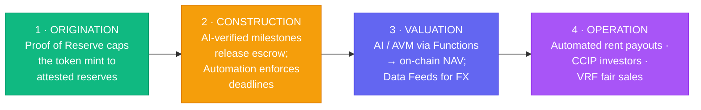
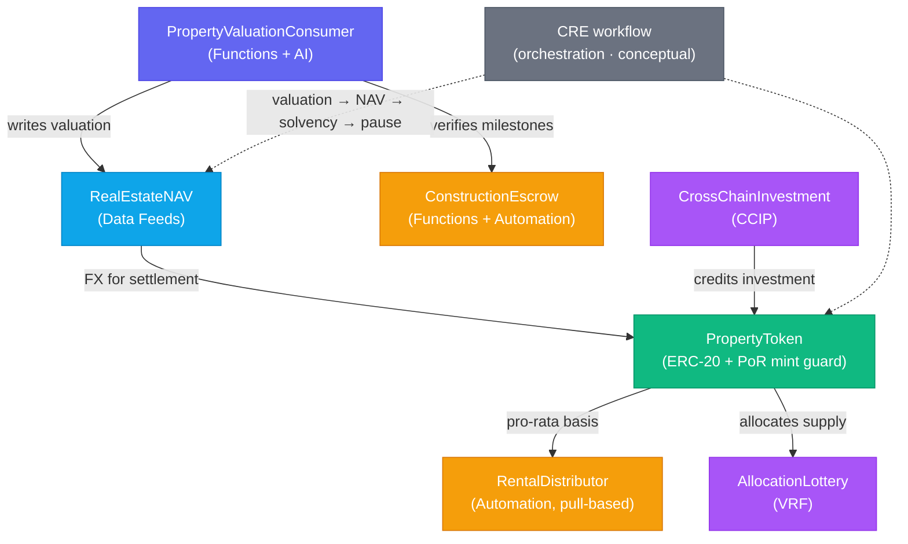

# Chainlink × RWA — Real Estate & Construction

**A working reference architecture for building real-world-asset (RWA) systems on Chainlink — eight products, one coherent platform.**

_Most Chainlink demos show one product in isolation. This repo instead builds a single believable business — **Cornerstone**, a platform that tokenizes income-producing real estate and finances the construction that creates it — and wires in as many Chainlink products as sensibly map to real RWA problems. Every contract earns its place in the same story._

**The use case:** tokenized real estate + milestone-based construction finance.
**Built with:** Solidity ^0.8.19 · Hardhat · OpenZeppelin · `@chainlink/contracts`.
**Status:** compiling contracts, **25 passing tests**, runs fully offline — educational, not audited.

| | |
|---|---|
| 📖 [Use case](docs/use-case.md) | The business problem and why oracles are required |
| 🏛️ [Architecture](docs/architecture.md) | How the contracts fit together |
| 🚀 [Quickstart](#quickstart) | Install · compile · test in three commands |
| 🌐 [Deployment](docs/deployment.md) | Taking it to a live testnet with real Chainlink services |
| 🔒 [Security & disclaimers](SECURITY.md) | What this is — and very much isn't |

> ⚠️ **Educational reference only.** Not audited, not production code, not legal or financial advice. Real RWA issuance involves securities law, KYC/AML, custody, and licensed appraisers far beyond what any smart contract handles. See [`SECURITY.md`](SECURITY.md).

---

## Table of contents

- [The products, and where each one fits](#the-products-and-where-each-one-fits) — the 8-product matrix
- [The property lifecycle](#the-property-lifecycle) — origination → construction → valuation → operation
- [Architecture](#architecture) — contracts mapped to products
- [Quickstart](#quickstart) — get it running locally
- [Repository layout](#repository-layout) — where everything lives
- [Learning path](#learning-path) — the order to read things in
- [What makes this different](#what-makes-this-different) — why this repo over a tutorial
- [Author & license](#author--license)

---

## The products, and where each one fits

| Chainlink product | Cornerstone use case | Contract | Guide |
|---|---|---|---|
| **Data Feeds** | USD ⇆ crypto conversion, NAV denomination | `oracle/RealEstateNAV.sol` | [data-feeds.md](docs/data-feeds.md) |
| **Proof of Reserve** | Block minting of unbacked property tokens | `token/PropertyToken.sol` | [proof-of-reserve.md](docs/proof-of-reserve.md) |
| **Functions + AI** | AI/AVM property valuation & milestone checks | `functions/PropertyValuationConsumer.sol` | [functions-and-ai.md](docs/functions-and-ai.md) |
| **Automation** | Scheduled rent payouts, milestone deadlines | `distribution/RentalDistributor.sol`, `escrow/ConstructionEscrow.sol` | [automation.md](docs/automation.md) |
| **CCIP** | Cross-chain investment (tokens + data) | `ccip/CrossChainInvestment.sol` | [ccip.md](docs/ccip.md) |
| **VRF** | Fair allocation of oversubscribed sales | `vrf/AllocationLottery.sol` | [vrf.md](docs/vrf.md) |
| **Data Streams** | Low-latency settlement (upgrade path) | _(documented)_ | [data-streams.md](docs/data-streams.md) |
| **CRE** | Orchestrate the whole NAV workflow | `cre/` _(scaffold)_ | [cre.md](docs/cre.md) |

> The **AI** angle lives in [`functions-source/`](functions-source) — the off-chain JavaScript a Chainlink DON runs to call an AVM/LLM, including the determinism rules that make calling a model from a contract actually converge across nodes.

---

## The property lifecycle

Every product participates in one continuous lifecycle, not a grab-bag of demos:



---

## Architecture



Full write-up in [`docs/architecture.md`](docs/architecture.md); the business narrative in [`docs/use-case.md`](docs/use-case.md).

---

## Quickstart

```bash
npm install      # build-tool-free: no Python / native compilation needed
npm run build    # compile the contracts
npm test         # 25 tests, fully local — no testnet or API keys required
```

Want to see the whole system deployed locally?

```bash
npx hardhat run scripts/deploy-core.ts
```

To deploy against **real** Chainlink services on a testnet, copy `.env.example` → `.env`, fill it in, and follow [`docs/deployment.md`](docs/deployment.md).

---

## Repository layout

```
contracts/        Solidity, one product area per folder
  token/          PropertyToken.sol            ERC-20 + Proof of Reserve mint guard
  oracle/         RealEstateNAV.sol            Data Feeds consumer
  functions/      PropertyValuationConsumer.sol Chainlink Functions + AI valuation
  escrow/         ConstructionEscrow.sol        Milestone escrow (Functions + Automation)
  distribution/   RentalDistributor.sol         Pro-rata income (Automation, pull-based)
  ccip/           CrossChainInvestment.sol      CCIP sender + receiver (+ vendored interfaces)
  vrf/            AllocationLottery.sol         VRF fair allocation
  mocks/          Mock*.sol                     Local stand-ins so tests run offline
functions-source/ *.js                          Off-chain Functions sources (the AI calls)
cre/              workflows/*.ts                CRE workflow scaffold (conceptual)
scripts/          deploy + ops scripts
test/             one suite per contract (25 tests)
docs/             one guide per Chainlink product
```

---

## Learning path

New here? Read in this order:

1. [Use case](docs/use-case.md) — the business problem and why oracles are needed
2. [Proof of Reserve](docs/proof-of-reserve.md) — the core RWA honesty mechanism
3. [Data Feeds](docs/data-feeds.md) — reading prices safely
4. [Functions + AI](docs/functions-and-ai.md) — bringing AI/off-chain data on-chain
5. [Automation](docs/automation.md) → [CCIP](docs/ccip.md) → [VRF](docs/vrf.md)
6. [CRE](docs/cre.md) — orchestrating it all

---

## What makes this different

1. **One business, not ten demos.** Every product is load-bearing in a single property lifecycle, so you see how the pieces *compose* — the part tutorials skip.
2. **It actually runs.** Contracts compile and a 25-test suite passes offline; lightweight mocks invoke the real Chainlink callbacks (`handleOracleFulfillment`, `rawFulfillRandomWords`, `ccipReceive`) so you exercise the genuine integration surface.
3. **The hard parts are shown, not hidden.** Oracle staleness/decimals checks, fail-closed PoR, AI confidence floors + deviation caps, CCIP allowlisting, VRF state-machine guards, pull-over-push distribution — each with a "why".
4. **AI done responsibly.** The Functions sources pin determinism (temperature 0, strict JSON) so DON nodes converge, keep the API key off-chain, and bound how far any single model run can move value.
5. **Honest about boundaries.** A clear-eyed [`SECURITY.md`](SECURITY.md) on trust assumptions, and a CRE section that distinguishes "ready today" from "evolving".

---

## Author & license

**Author:** Willis Tang — [@ProjectWaja](https://github.com/ProjectWaja) | Project Waja
**License:** [MIT](LICENSE)

_Unaffiliated with Chainlink Labs. "Chainlink" and product names belong to their respective owners._
