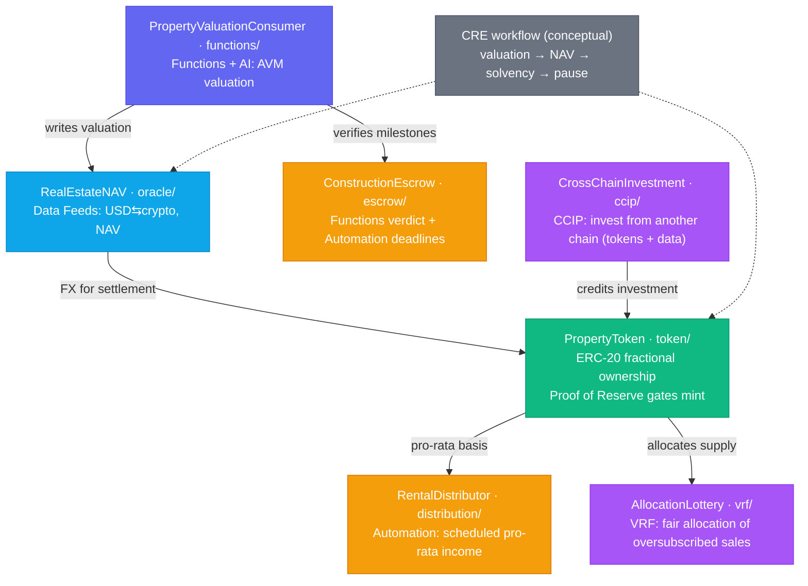

# Architecture

Cornerstone is organized so that each Chainlink product maps to a clear contract (or section of
one). Nothing is a throwaway demo — every piece participates in the
[property lifecycle](./use-case.md).

## Contract map



## Directory layout

```
contracts/
  token/        PropertyToken.sol            ERC-20 + Proof of Reserve mint guard
  oracle/       RealEstateNAV.sol            Data Feeds consumer (ETH/USD, NAV)
  functions/    PropertyValuationConsumer.sol Chainlink Functions + AI valuation
  escrow/       ConstructionEscrow.sol        Milestone escrow (Functions + Automation)
  distribution/ RentalDistributor.sol         Pro-rata income (Automation, pull-based)
  ccip/         CrossChainInvestment.sol      CCIP sender + receiver
  vrf/          AllocationLottery.sol         VRF fair allocation
  mocks/        Mock*.sol                      Local stand-ins for tests
functions-source/  *.js                        Off-chain Functions sources (AI calls)
cre/               workflows/*.ts              CRE workflow scaffold (conceptual)
scripts/           deploy + ops scripts
test/              one suite per contract
docs/              one guide per product
```

## Design principles

- **One coherent business.** Every product earns its place in the property lifecycle, so the
  repo reads as a system, not a grab-bag.
- **Fail closed on oracle trouble.** Stale/invalid feeds pause sensitive actions (mint, NAV
  apply) rather than proceeding on bad data.
- **Bound external influence.** AI/AVM outputs and cross-chain senders are constrained
  (deviation caps, confidence floors, allowlists) so a single bad input can't run away.
- **Gas-safe distribution.** Income is pull-based, so cost doesn't scale with holder count.
- **Self-contained tests.** Lightweight mocks invoke the Chainlink callbacks directly, so
  `npm test` runs without live networks or the full Chainlink simulator.

See [deployment.md](./deployment.md) for taking it to a testnet with real Chainlink services.
