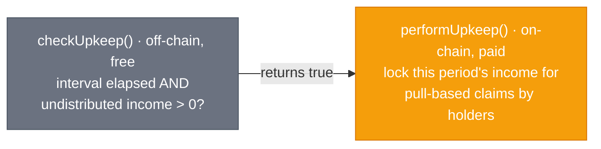

# Chainlink Automation in Cornerstone

Smart contracts are passive — they only execute when someone sends a transaction. RWA
operations, though, are full of *scheduled* and *conditional* actions: pay rent monthly,
refresh the valuation weekly, refund investors if a construction milestone blows its
deadline. **Chainlink Automation** provides the decentralized "someone" that reliably calls
your contract when a condition is met, without you running a centralized cron server.

## Two upkeeps in Cornerstone

### 1. Scheduled rental distribution — `RentalDistributor`
The distributor is itself `AutomationCompatible`. Chainlink nodes call `checkUpkeep()`
off-chain (free, view); when an interval has elapsed *and* there is income to distribute, it
returns `true` and the network calls `performUpkeep()` to snapshot the period and make the
income claimable pro-rata.

### 2. Milestone deadline enforcement — `ConstructionEscrow`
The escrow exposes `checkUpkeep`/`performUpkeep` that scan for milestones whose deadline has
passed without verification, and move them to an `Overdue` state so investors can reclaim
locked capital. No human has to remember to police deadlines.

## Patterns demonstrated

- **`checkUpkeep` does the work, `performUpkeep` is cheap & guarded.** All the searching and
  branching happens in the free off-chain `checkUpkeep`; `performUpkeep` re-validates the
  condition (never trust the passed-in `performData` blindly) and acts.
- **Idempotency / re-validation.** `performUpkeep` can be called by anyone, so it re-checks
  the condition on-chain before mutating state.
- **Pull over push.** Rental income is made *claimable* rather than looped-and-pushed to every
  holder, so distribution cost doesn't scale with the holder count (a classic gas-grief trap).

## Time-based vs. custom-logic upkeeps

For a fixed schedule with no on-chain condition (e.g. "call `refreshValuation()` every Monday")
you can register a **time-based** upkeep in the Automation UI against an existing function — no
special interface needed. Cornerstone uses **custom-logic** upkeeps (`checkUpkeep`/
`performUpkeep`) because the actions are conditional, not purely time-driven.

## Files

| File | Role |
|---|---|
| `contracts/distribution/RentalDistributor.sol` | Automation-driven pro-rata income distribution |
| `contracts/escrow/ConstructionEscrow.sol` | Automation-driven milestone deadline enforcement |
