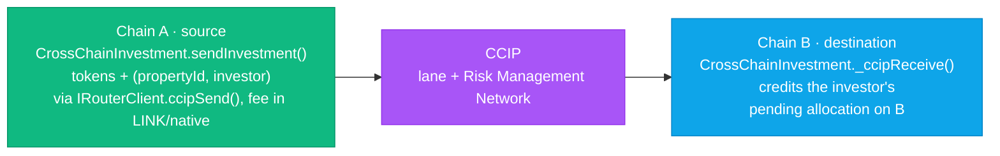

# Chainlink CCIP in Cornerstone

Capital and investors are spread across many chains. **CCIP (Cross-Chain Interoperability
Protocol)** lets Cornerstone accept investment from another chain and coordinate state across
chains without a custom bridge — using Chainlink's risk-managed messaging (including the
independent Risk Management Network).

## The cross-chain investment flow

An investor holds funds on Chain A (say, a stablecoin on Base Sepolia) but the property token
lives on Chain B (Arbitrum Sepolia). With `CrossChainInvestment`:

The message carries **both tokens and data** (the `propertyId` and the beneficiary), so the
destination contract knows *what* the arriving funds are for, not just that money showed up.

## Patterns demonstrated

- **Allowlisting.** The receiver only accepts messages from trusted source chains *and*
  trusted sender addresses (`allowlistedSourceChains`, `allowlistedSenders`). This is the
  single most important CCIP safety control — without it anyone can call your receiver path.
- **Fee abstraction.** `ccipSend` is paid in LINK (or native); the sender computes the fee with
  `getFee` and approves it before sending.
- **Extra args / gas limit.** The destination execution gas limit is set explicitly via
  `Client.EVMExtraArgsV2`, so the receiver callback can't be starved.
- **Receiver is `CCIPReceiver`.** Only the configured router may invoke `ccipReceive`; the
  contract overrides `_ccipReceive` to decode and credit the investment.

## Why not just bridge?

Generic bridges have been among the largest exploit targets in the space. CCIP adds a separate
Risk Management Network that independently monitors and can pause cross-chain traffic, plus
rate limits per lane. For RWAs — where the "asset" is real and the stakes are legal as well as
financial — that defense-in-depth matters.

## Files

| File | Role |
|---|---|
| `contracts/ccip/CrossChainInvestment.sol` | Sends and receives cross-chain investment (tokens + data) |
| `contracts/mocks/MockCCIPRouter.sol` | Local stand-in router for tests |

> Testing CCIP end-to-end normally uses Chainlink's `@chainlink/local` simulator. To keep this
> repo's test suite self-contained, `MockCCIPRouter` exercises the send path and invokes the
> receiver callback directly. See [deployment.md](./deployment.md) for live-testnet steps.
