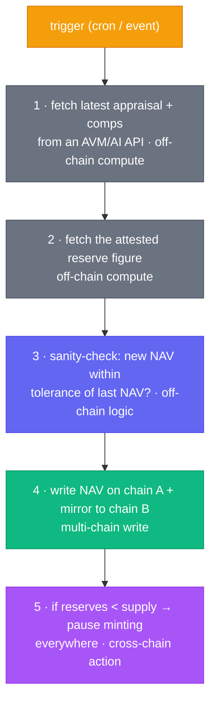

# Chainlink Runtime Environment (CRE) for RWAs

> **Status:** the CRE SDK and tooling are new and evolving. This document explains
> *where CRE fits* in the Cornerstone architecture and provides a **conceptual workflow
> scaffold** (see [`/cre`](../cre)). Treat the workflow code as a pattern to adapt against
> the current CRE docs, not a pinned, runnable deployment.

## What CRE is, in one paragraph

The individual Chainlink services in this repo (Functions, Data Feeds, Automation, CCIP, …)
are powerful but you wire them together yourself — a Functions consumer here, an Automation
upkeep there, a feed read somewhere else. The **Chainlink Runtime Environment (CRE)** is the
layer that lets you express a *multi-step, cross-chain workflow* as a single program that
Chainlink's decentralized infrastructure runs for you: "on a trigger, fetch off-chain data,
run some compute, read/write across chains, and report the result on-chain." It turns the
ad-hoc glue between services into one declarative, verifiable workflow.

## Why RWAs need orchestration

A single Cornerstone NAV update is not one call — it's a *sequence*:

Doing this with separate Automation + Functions + CCIP contracts means a lot of on-chain
plumbing and several round-trips. In CRE the whole sequence is **one workflow** with one
trigger, off-chain compute steps, and on-chain "write" steps — cheaper, simpler, and easier
to reason about.

## How the pieces map

| Step in the workflow | Done today with… | Done in CRE with… |
|---|---|---|
| Schedule / event trigger | Automation upkeep | a workflow **trigger** (cron or on-chain log) |
| Call an AI/AVM/HTTP API | Functions consumer + DON | an HTTP/compute **capability** |
| Branching / validation logic | Solidity in a consumer | plain code in the workflow |
| Write a result on-chain | `fulfillRequest` callback | an EVM **write** capability |
| Act on another chain | a separate CCIP message | another EVM write target in the same workflow |

## Where to look next

- The scaffold and a heavily-commented walkthrough live in [`/cre`](../cre).
- Because the SDK surface changes, each step in the scaffold is annotated with the *intent*
  ("trigger", "http fetch", "evm write") so you can map it onto whatever the current CRE
  SDK calls these primitives.
- The mature, ready-today equivalent of this workflow is implemented across
  `PropertyValuationConsumer` (Functions), `RealEstateNAV` (Data Feeds), and the Automation
  upkeeps — so you can compare "wire it yourself" vs. "express it as a CRE workflow."
