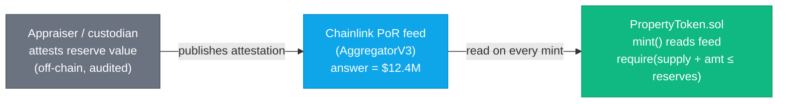

# Proof of Reserve in Cornerstone

The central honesty question for any RWA token is: **"is this token actually backed by the
real-world asset it claims?"** Chainlink **Proof of Reserve (PoR)** answers it by publishing
an independently-attested reserve figure to an on-chain feed (the same `AggregatorV3Interface`
shape as a price feed). A token contract can then *refuse to mint* more than the reserves
support.

## The mint guard

`PropertyToken` is gated by a PoR feed. The rule is simple and enforced in code, not policy:

```
   totalSupply() + amountToMint   ≤   attestedReserves()
```

If an issuer tries to mint tokens beyond the appraised, attested value of the underlying
property portfolio, the transaction reverts. Holders get an on-chain, continuously-checkable
guarantee instead of a press release.



## Design choices shown in the code

- **Reserves and supply in the same unit.** The mock PoR feed reports reserves in *whole USD*;
  `PropertyToken` converts its supply to the same unit using a configured price-per-token so
  the comparison is apples-to-apples. Getting units wrong is the classic PoR bug.
- **Staleness applies here too.** A PoR feed that hasn't updated recently is treated as
  untrusted — minting pauses rather than trusting a frozen attestation.
- **Fail closed.** Any feed error (stale, zero, reverting) blocks minting. Reserves must be
  *positively* demonstrated, never assumed.
- **Burning is always allowed.** Reducing supply can only improve the collateral ratio, so
  burns/transfers are never blocked by the guard.

## Why this matters more for RWAs than for stablecoins

PoR is often discussed for stablecoins, but RWAs raise the stakes: the "reserve" is an
illiquid, appraised, off-chain building. The attestation pipeline (who appraises, how often,
under what audit standard) is the hard part — the smart contract is the easy, enforceable
last mile. Cornerstone implements the last mile and documents the pipeline assumptions in
[`SECURITY.md`](../SECURITY.md).

## Files

| File | Role |
|---|---|
| `contracts/token/PropertyToken.sol` | PoR-gated ERC-20 representing fractional property ownership |
| `contracts/mocks/MockAggregatorV3.sol` | Stands in for the PoR feed in tests |
