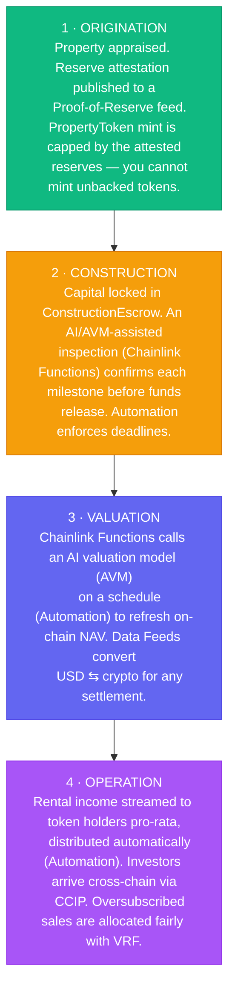

# Use case: tokenized real estate & construction finance

This repository uses a single, coherent fictional platform — **Cornerstone** — to show
where each Chainlink product fits in a real-world-asset (RWA) system. Rather than ten
disconnected demos, every contract plays a role in one believable business.

## The business

Cornerstone does two related things:

1. **Tokenizes income-producing real estate.** A building (or a fund of buildings) is
   represented on-chain by an ERC-20 token, `PropertyToken`. Each token is a fractional
   claim on the property and its rental income. Investors buy tokens; the protocol must
   prove the tokens are actually backed by real, appraised property.

2. **Finances construction.** Before a building produces income, it has to be built.
   Cornerstone runs milestone-based escrows: investor capital is locked and released to
   the builder only as independently verified milestones are completed (foundation poured,
   framing inspected, certificate of occupancy issued, …).

Both halves of the business depend on **trustworthy off-chain truth**: what is the property
worth today, are the reserves real, was the milestone actually completed, what is the
USD/crypto exchange rate at settlement. That is precisely the gap Chainlink fills.

## Lifecycle of a Cornerstone property

## Why each problem needs an oracle

| Real-world problem | Naive on-chain answer | Why it fails | Chainlink answer |
|---|---|---|---|
| "What is this building worth?" | Hard-code a number / trust an admin | Manipulable, stale, centralized | **Functions + AI/AVM** writing to a feed |
| "Are these tokens actually backed?" | Trust the issuer's word | No way to verify reserves on-chain | **Proof of Reserve** feed gating mint |
| "Was the milestone really completed?" | Builder self-reports | Builder is incentivized to lie | **Functions** calling an inspection/AI API |
| "What's the USD value of this ETH payment?" | Use a single DEX spot price | Thin liquidity, easily manipulated | **Data Feeds** (aggregated, decentralized) |
| "Pay everyone their rent on the 1st" | Hope someone calls the function | Liveness depends on a human/keeper | **Automation** (decentralized triggers) |
| "Let investors join from another chain" | Bridge manually | Bridges are a top exploit target | **CCIP** (risk-managed cross-chain) |
| "Fairly allocate an oversubscribed sale" | `block.timestamp % n` | Miner/validator manipulable | **VRF** (verifiable randomness) |
| "Coordinate all of the above" | Stitch scripts together off-chain | Brittle, centralized glue | **CRE** (orchestrated workflows) |

## A note on realism

This is a **reference architecture**, not audited production code or legal/financial advice.
Real RWA issuance involves securities law, KYC/AML, custody, and qualified appraisers far
beyond what any smart contract handles. The goal here is to show *how the Chainlink pieces
connect* so you can adapt the patterns. See [`SECURITY.md`](../SECURITY.md) and the
disclaimer in the root [`README.md`](../README.md).
