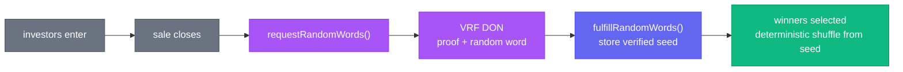

# Chainlink VRF in Cornerstone

When a popular property token sale is **oversubscribed** — more demand than supply — *who gets
allocated?* Doing it first-come-first-served invites gas wars and bots; doing it with
`block.timestamp` or `blockhash` is manipulable by validators. **Chainlink VRF (Verifiable
Random Function)** provides randomness that is provably fair and tamper-proof, with an on-chain
cryptographic proof.

## The fair-allocation flow

`AllocationLottery` collects entrants during a sale window, then requests randomness to select
winners for the limited token allocation:

The random word seeds a deterministic selection (e.g. a Fisher–Yates shuffle of entrants),
so the *outcome* is reproducible and auditable given the seed, while the *seed itself* could
not be predicted or biased by anyone — including the dev, the miners, or the entrants.

## Patterns demonstrated (VRF 2.5)

- **Subscription model.** The contract is a `VRFConsumerBaseV2Plus`; a funded subscription pays
  for requests (in LINK or native via `nativePayment`).
- **Request → callback split.** `requestRandomWords` returns a `requestId`; the coordinator
  later calls `fulfillRandomWords`. State machine guards prevent acting before fulfilment.
- **Don't compute winners in the callback if it's unbounded.** The callback only *stores* the
  seed; the (potentially gas-heavy) winner derivation is a separate, paginated call. Keeping
  `fulfillRandomWords` cheap avoids exceeding the callback gas limit.
- **One request per sale.** Re-requesting is blocked once a seed exists, so the result can't be
  "re-rolled" until someone likes it.

## Files

| File | Role |
|---|---|
| `contracts/vrf/AllocationLottery.sol` | VRF-seeded fair allocation for oversubscribed sales |
| `contracts/mocks/MockVRFCoordinator.sol` | Local coordinator that fulfils requests in tests |
